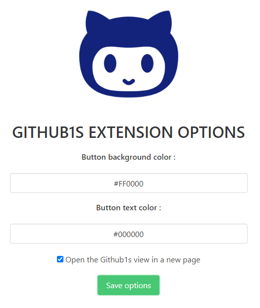

  

# Github1s Extension

A chrome/firefox extension that allows you to open github repositories in VSCode with [Github1s](https://github.com/conwnet/github1s)

## Installation

**CHROME**
* Download the repository
* Go to `chrome://extensions/`
* Enable the `Developer Mode`
* Click on `Load unpacked`
* Select the repository folder

**FIREFOX** - [**Download from the Mozilla Add-Ons**](https://addons.mozilla.org/firefox/addon/github1s-extension/)

Or with the developer mode
* Download the repository
* Go to `about:debugging#/runtime/this-firefox`
* Click on `Loading a temporary add-on`
* Select the repository `content.js` file

## Features

**Add a button to open the current repository on github1s**

* Button background color customization
* Button text color customization
* Button title customization
* Open the Github1s view in a new page
* Adapt color to your github theme (light or dark mode)

## Options

**CHROME**
* Go to `chrome://extensions/`
* Click on `Github1s Extension details`
* Click on `Extension options`

**FIREFOX**
* Got to `about:addons`
* Click on `Extensions`
* Select the extension
* Click on `Options`

## Discord

Join the Discord server !

## Contributing

Pull requests are welcome. For major changes, please open an issue first to discuss what you would like to change.

Please make sure to update tests as appropriate.

## License

This project is under [GPLv3](LICENSE).
